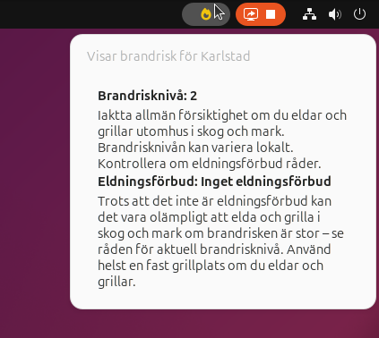

# Fire risk Gnome extension

This is an Gnome extension for Gnome 49 that shows fire risk and fire ban for your location in Sweden. This extension won't do
anything for you if your location is set elsewhere.  

At the moment there's no way to set the location. The extension uses ipwho to get your approx location.  

The icon switches color from green -> yellow -> orange -> red depending on the risk level. The status is updated every 5 minutes.  

## Installation
Download the zip-file and run:
gnome-extensions install firerisk@jonas.jonika.nu.zip

## Credits
It uses the following API:s  
- https://ipwho.is to get your location by IP
- https://api.msb.se/brandrisk/v2/swagger/index.html for fire risk information

### Icon
This project uses icons from Font Awesome Free (https://fontawesome.com), licensed under CC BY 4.0.
